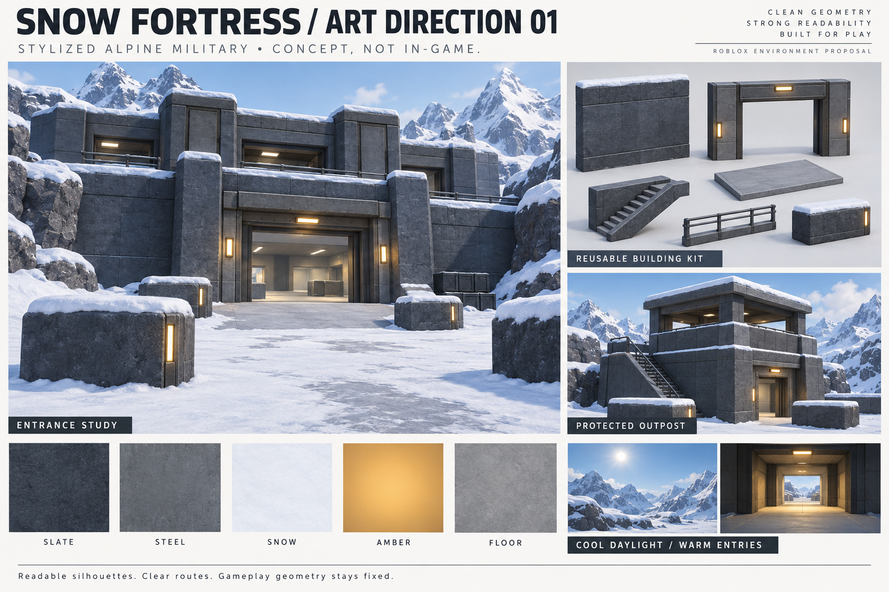

# Snow Fortress — art direction 01

## Blender architectural kit — prepared for import

The [entrance kit](../../../assets/environment/snow-fortress/entrance-kit-v1/README.md) contains seven original mesh modules, an editable Blender scene, baked PBR textures, FBX/GLB exports, player-height renders and a Studio review assembler. It develops a substantial entrance and adjacent interior at the existing 20-by-13-stud doorway scale. Export round trips and geometry checks passed. The kit has **not** been imported into Studio or installed in Convergence; the running source still uses the procedural art pass below. The taller piers and deeper structural modules require deliberate collision/route integration, followed by in-engine visual and mobile performance review.

## Full-map application — alpine-art-v2

User approved expansion from the entrance study. The reusable AlpineFortress treatment now applies slate/steel/concrete across the fortress, all four entrance treatments, both floors and stairways, protected outposts, cover and sightline walls. Snow covers exterior ground and thin caps on existing roofs/walls/cover. Warm local lights mark entrances and outpost shelter; clear cool daylight and zero bloom preserve contrast. No decorative mountains, imported meshes, extra cover or new routes were added.

Build: `builds/SnowFortress-alpine-art-v2.rbxl`. Player map voting and bot settings remain enabled. Select Snow Fortress and look for `[MapBuild] SnowFortress / alpine-art-v2`. Source checks passed; appearance, phone performance and enemy visibility still require the user's live review. This is the implemented modular art pass, not a claim of matching the generated reference pixel-for-pixel. No Computer Use performed.

Historical entrance study (subsequently approved and expanded): first west-entrance treatment implemented as `west-entrance-art-v1`, awaiting the user's in-game review before expansion. Created 2026-09-20 with the built-in image-generation tool. This is concept art, not an in-game capture, asset pack, or measured architectural plan.

Build: `builds/SnowFortress-west-entrance-art-v1.rbxl`. Map voting remains enabled. Select Snow Fortress to inspect the west (Blue-side) entrance. The rest of the map retains graybox treatment. Implemented: slate on west wall sections, steel jamb/fascia details, thin snow caps, concrete ramp/upper west walking strip, two warm local lights. Uses `Shared/MapArt/AlpineFortress` and the existing map builder. No new collision geometry; trim has `decor=true`, and light anchors are excluded from collision and queries. Generated concept detail and material fidelity are a target, not a claim of equivalent in-engine results.

Passed source checks: map validation, floor/stair/traversal regression, lint, formatting and Rojo build. Device performance, enemy visibility and actual appearance require the user's Studio review. No Computer Use performed.

## Latest polish and playtest handoff

Version 2 adds continuous steel slab-edge fascia, dark foundation bands on existing walls, and inset amber stair-tread markings. Decorative parts cannot collide, intercept raycasts, or emit touch events. All gameplay solids and route coordinates are preserved. The treatment uses built-in materials and procedural geometry; imported production meshes and PBR assets are not part of this build. AAA visual quality is a target, not a verified result.

Verification: formatting, Selene, all five map audits, fortress traversal/floor checks, match-entry recovery, finale selection, and Rojo build passed. No Computer Use. In Studio, reconnect Rojo if needed, stop and restart play, then vote for Snow Fortress. Alternatively open the standalone build. Check both staircases, upstairs C, outpost firing slots, visibility against snow, and mobile frame rate.

## Visual rules

- Broad dark slate masses; medium-value steel frames; lighter neutral walking surfaces.
- Snow on exposed upper edges and exterior ground; no snow piles blocking entrances, stairs, firing openings or landing areas.
- Cool daylight with restrained warm entrance lights. Keep interiors readable from outdoors; no heavy fog or bloom obscuring enemies.
- One consistent building kit: wall, doorway, floor, stairs, guardrail and cover. Map-specific art never changes shared gameplay numbers.
- The board proposes materials and forms only. Its window arrangement, roof silhouette and nearby rocks are not permission to change the approved graybox or add sightline blockers.

## First implementation slice after approval

Use the existing west fortress entrance, its existing ramp and the immediately adjacent interior. Apply the material palette, wall treatment, restrained snow caps and doorway lighting. Retain both upper stair openings, full upper floor, upstairs C, four launch approaches, diagonal zip arrivals and outpost positions.

Keep collision dimensions identical to the graybox. Decorative elements should not collide, receive gameplay raycasts, or hide players. Reuse the existing map builder and separate visual parts from gameplay solids explicitly before expanding the kit.

Review the first slice from player height, approaching and leaving the doorway, on desktop and phone. Check enemy/background separation, lighting exposure, traversal clearance and measured performance. A generated image is not evidence that these tests passed. Expand to the rest of the fortress only after the slice meets the target.

## Review decision

Approve or revise the overall stone/steel/snow treatment and warm-entry lighting. Actual match balance and geometry approval remain separate from this visual choice. The user will perform Studio testing; no Computer Use is part of this pass.

Generation prompt: [art-direction-01-prompt.txt](art-direction-01-prompt.txt).
