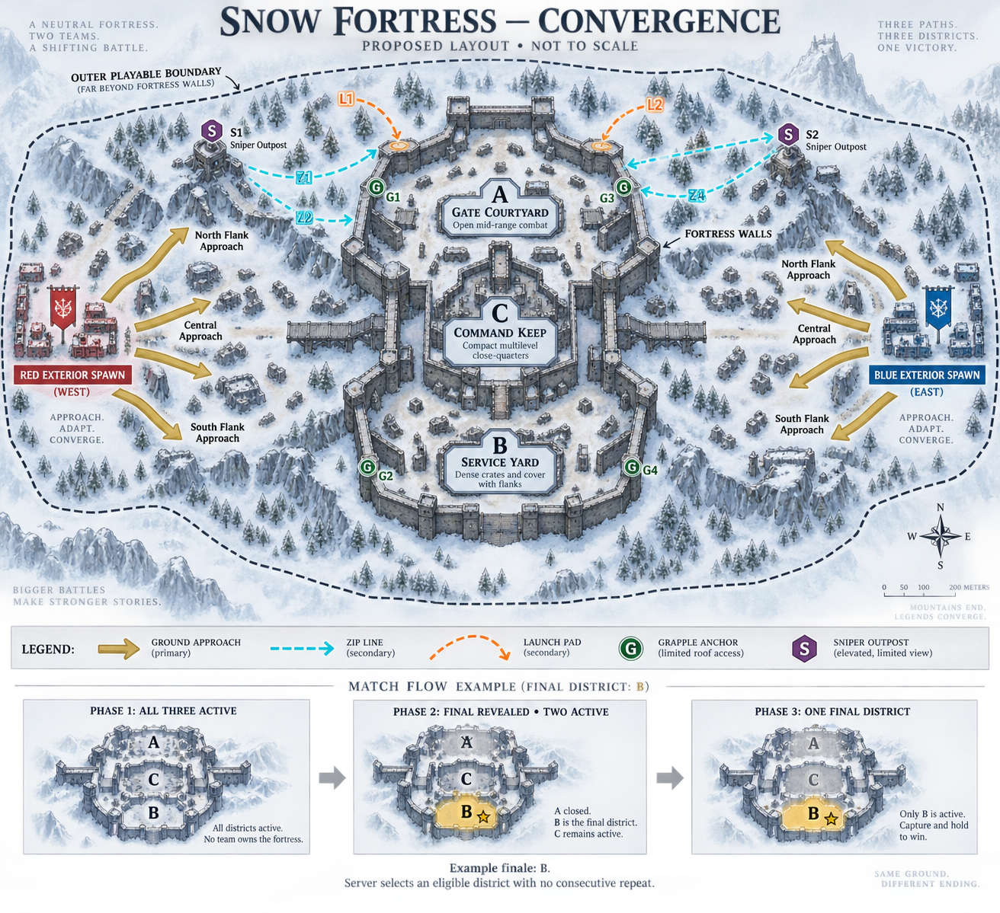

# Snow Fortress concept sketch

Generated with the built-in image-generation tool on 2026-09-20.

Concept only, not an as-built layout or dimensional plan. The decorative meter scale is not authoritative. Ground arrows indicate approach choices rather than finalized navigation paths. Zip-line direction, launch origins, entrances, cover and counter-routes require blockout validation. The phase strip uses B as an example; any eligible district can be selected without a consecutive repeat on the same server.

## Generation brief

Landscape top-down architectural ink and watercolor snowy fortress sketch. Opposing red west and blue east exterior spawns, neutral fortress, outer playable boundary beyond all approaches. Three generously separated districts: A Gate Courtyard north (open mid-range), B Service Yard south (dense cover and flanks), C Command Keep central (vertical close-quarters). Three primary ground approaches from each side. Two sniper outposts with ground counters, four optional zip lines, two launch pads with predictable landings, four contextual grapple anchors. Limited roof access. Clear route legend. Three-phase strip: all three active; finale revealed with two active; one final district. Use B as an example, state server eligibility and no consecutive repeat. Mark proposed layout and not to scale.
