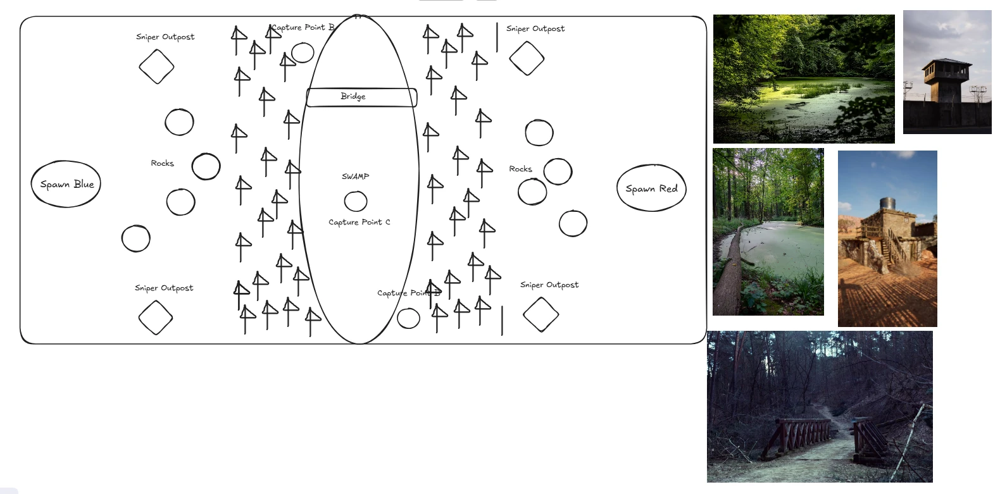

# Swamp concept sketch

Author: the user (hand sketch plus a photo reference board), supplied 2026-09-20. This is the **authoritative
design intent** for the Swamp map. Where the spec departs from it, the spec records the deviation and the reason.

Concept only, not an as-built layout or a dimensional plan. Nothing in the sketch is to scale; the relative
placement of districts is the intent, the coordinates are not. Capture-point count and placement in the sketch
predate the mode-contract check and were revised — see the deviation table in the spec.

## What the sketch specifies

| Sketch element | Design intent |
| --- | --- |
| Wide landscape rectangle, rounded corners | Arena boundary, much wider west–east than deep north–south |
| "Spawn Blue" (west) and "Spawn Red" (east) ellipses | Opposed spawns on the long axis |
| Central full-depth vertical ellipse, "SWAMP" | Contested water basin running north–south down the centre line |
| Horizontal band across the north of the swamp, "Bridge" | The dry crossing between the two halves |
| "Capture Point C" at the centre of the swamp | Central objective, in the water |
| "Capture Point A" and "Capture Point B" at the north end | Objectives near the bridge |
| "Capture Point D" at the south end | Objective at the far end of the basin |
| Two thick conifer bands flanking the swamp | Sightline breakers between the flanks and the centre |
| "Rocks" clusters, both sides | Hard cover in the open ground between spawn and treeline |
| Four "Sniper Outpost" diamonds, one per corner quadrant | Elevated long-range positions outboard of the treeline |
| Short vertical ticks beside the outposts | Vertical elements on the outposts (ladder/pole/mast) |

## Photo reference board (art target)

1. Algae-covered green swamp water in dense summer woodland — the water and canopy target.
2. Weathered concrete-and-timber watchtower with a boxed cab on legs — the sniper outpost vocabulary.
3. Swamp channel with a plank/fallen-log walkway along the bank — the bank traversal vocabulary.
4. Rough stone-and-timber bunker with a metal chimney and a slit opening — the hard-cover vocabulary.
5. Wooden trestle footbridge over a gully — the bridge vocabulary.

The board is a silhouette and material reference. It is **not** a colour or value reference: this project's
readability rules keep the environment soft, cover loud, and indicators neon, and never desaturate. See the art
direction section of the spec for the palette that reconciles the two.
